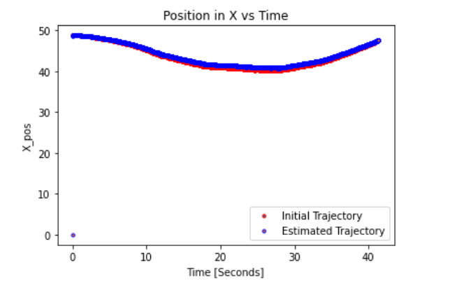

# Sensor-Fusion-with-Multi-Dimensional-Kalman-Filter
This repository includes the implementation of Multidimensional Kalman filter with sensor fusion to estimate a trajectory by fusing measurements from an accelerometer and a GPS.

## Implemented Algorithm

  

## Result

  

